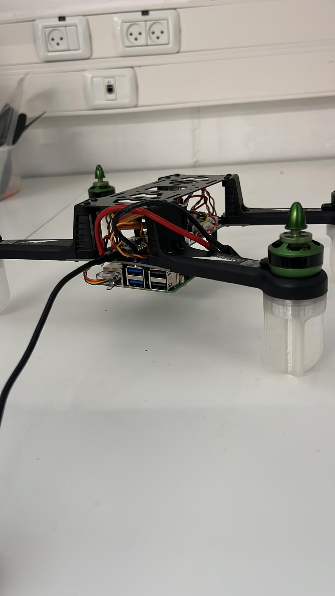

# DIY drone base Arduino
    the drone basae of spedix 250 fram and make the sutable pcb for this drone 

 ## hardware
    1) teensy 4.1 
    2) step down polulo 5v 
    3) 4 esc that you know how to config with pwm value 
    4) 4 motor 

    the schamtics discribe at the pcb dir and also the jeson 

## code 
    the code split into some section:
    1) comclass -> class the contain the complimntry filter 
    2) var_type -> varible , define and struct for all the code  
    3) dron_com - > the class that make the comunicate with the rtcom 
    4) motor_control -> motor control with pwm to motor 
    5) PID_type -> the pid config of the drone 
    6) node -> src code that take the msg from the teeny and publish it to the plotjuggler 

### mission that need to finish 
    1) connect the pi and make the send tata from the udf automaticly 
    2) pid config -> config the rate mode 

##pictur of the drone build:

