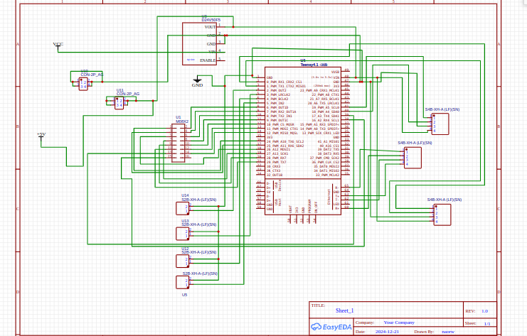
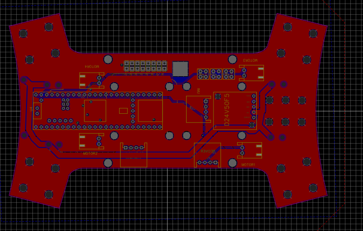
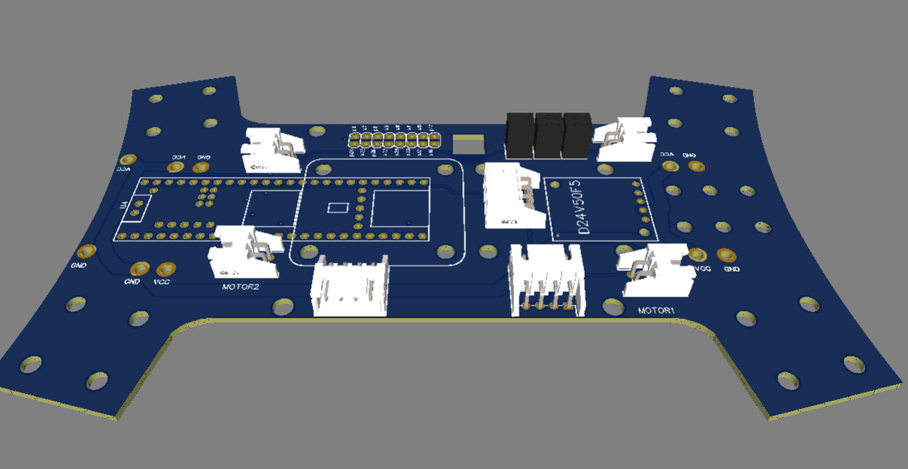

# explain about the pcb:
    the file of the pcb save as jason and can be open at easyeda 

# scamatic:

# pcb layout:

# pcb 3d:

### mission to fix:
    the location of the pi in the farme of the drone isnt place so good - > the eterenth connector need to move 