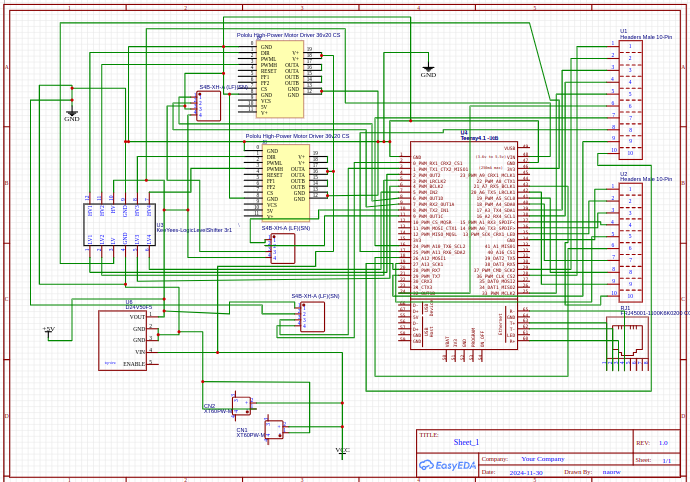
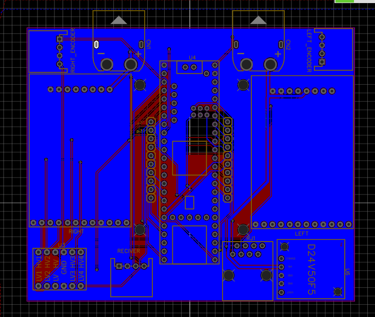
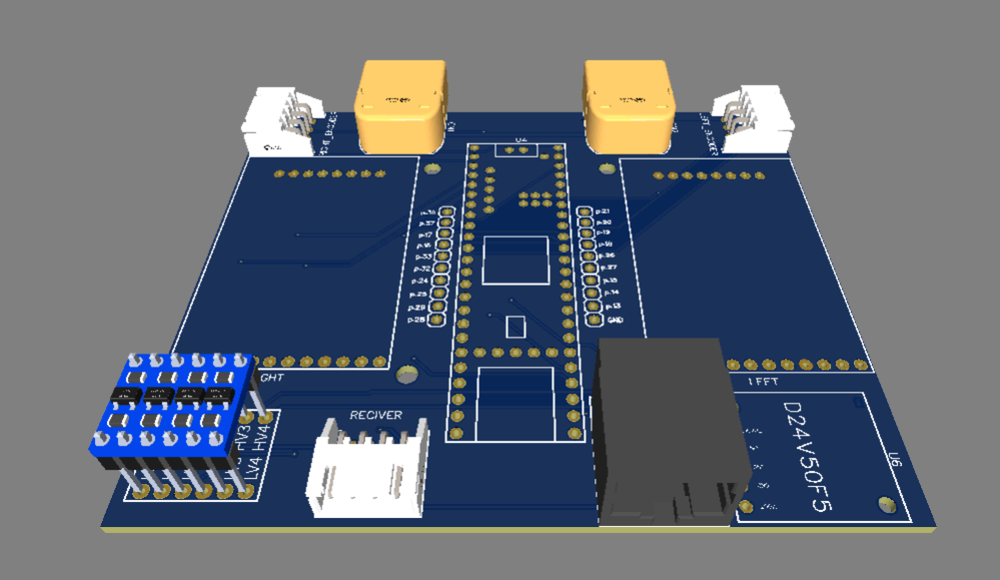

# explain about the pcb:
    the file of the pcb save as jason and can be open at easyeda 

# scamatic:

# pcb layout:

# pcb 3d:

### mission to fix:
    1) at one of the driver of the motor i routing somtings worngs -> need to fix this problem 
    2) need to add a location for the lidar that connect to the teensy 